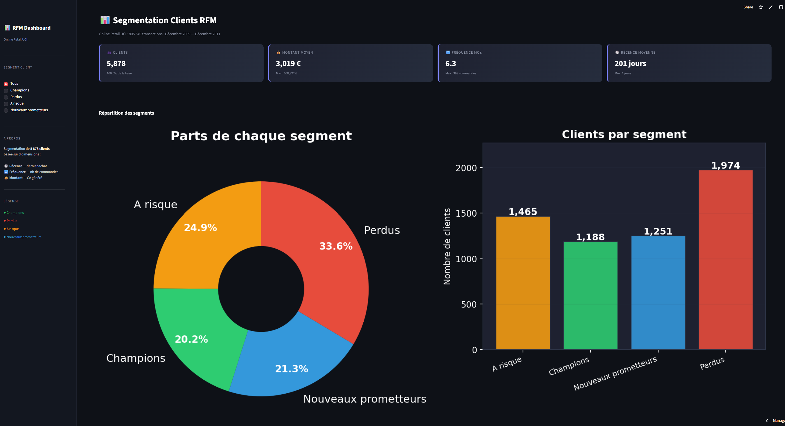
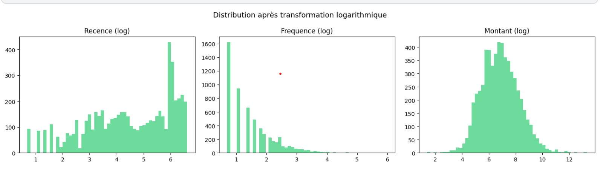
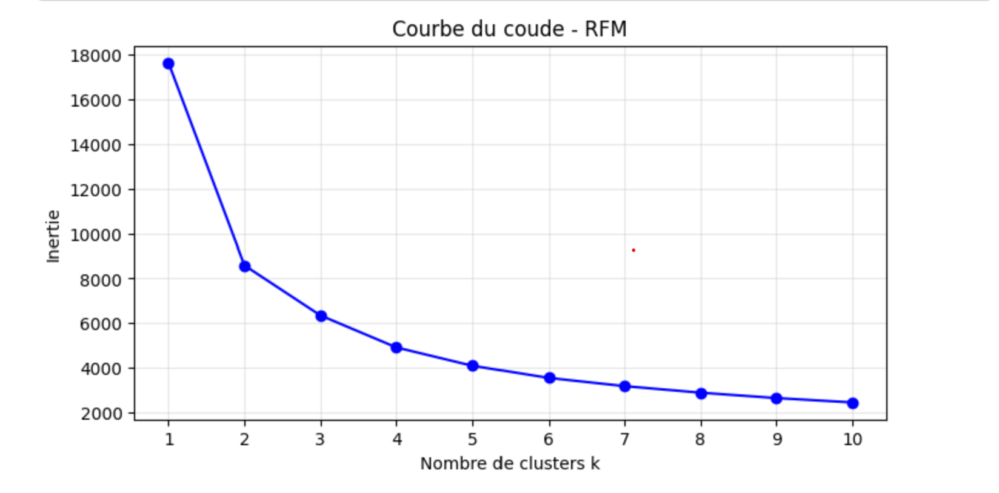
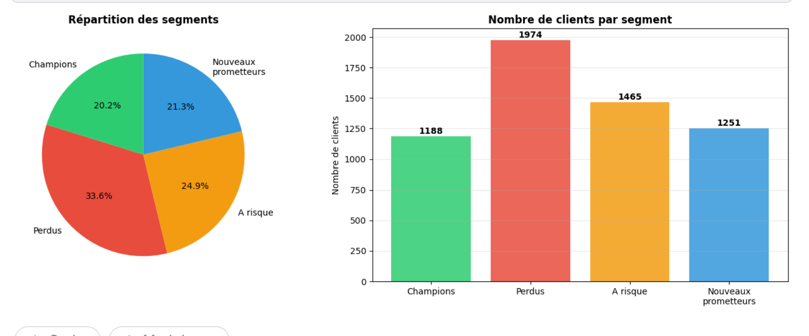
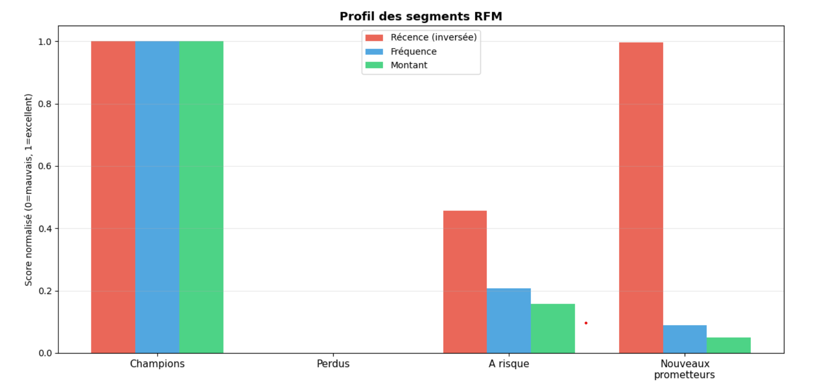
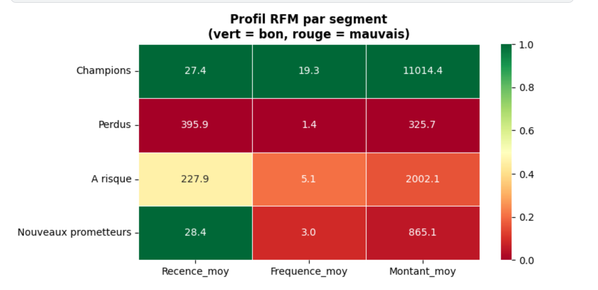
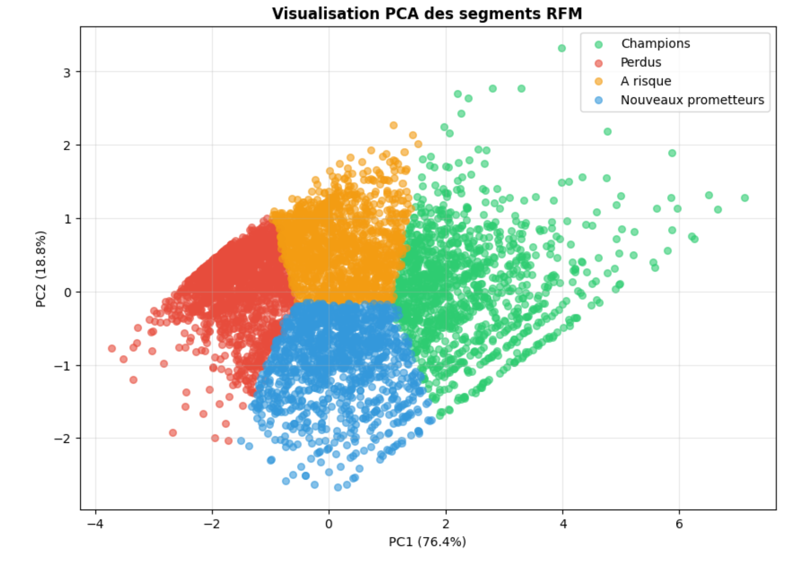

# Segmentation clients par analyse RFM

🚀 **Dashboard live** : https://rfm-dashboard-gueye.streamlit.app

## Aperçu



## Contexte

Un retailer e-commerce souhaite mieux cibler ses actions
marketing. Plutôt qu'une communication uniforme, l'objectif
est d'identifier des groupes de clients homogènes selon
leur comportement d'achat réel à partir de transactions brutes.

## Qu'est-ce que le RFM ?

La méthode RFM est une technique marketing qui évalue 
la valeur d'un client selon 3 dimensions :

| Dimension | Signification | Interprétation |
|---|---|---|
| **R**écence | Jours depuis le dernier achat | Plus c'est faible, mieux c'est |
| **F**réquence | Nombre de commandes distinctes | Plus c'est élevé, mieux c'est |
| **M**ontant | Chiffre d'affaires total généré | Plus c'est élevé, mieux c'est |

Un client idéal a acheté **récemment**, **souvent** 
et pour un **montant élevé**.

Ces 3 variables sont construites à partir des transactions 
brutes — c'est la partie feature engineering du projet.

## Dataset

- **Source** : [Online Retail UCI](https://www.kaggle.com/datasets/mashlyn/online-retail-ii-uci)
- **Période** : décembre 2009 → décembre 2011
- **Volume brut** : 1 067 371 transactions, 43 pays
- **Après nettoyage** : 805 549 transactions, 5 878 clients

## Méthodologie

1. Nettoyage des données
2. Feature engineering — création des variables RFM
3. Transformation logarithmique
4. Normalisation et clustering KMeans
5. Visualisation PCA et profilage des segments
6. Recommandations marketing

## Distribution des variables RFM



## Courbe du coude



## Résultats

| Segment | Clients | Récence moy. | Fréquence moy. | Montant moy. |
|---|---|---|---|---|
| Champions | 1 188 (20.2%) | 27 jours | 19 commandes | 11 014€ |
| Perdus | 1 974 (33.6%) | 396 jours | 1 commande | 326€ |
| A risque | 1 465 (24.9%) | 228 jours | 5 commandes | 2 002€ |
| Nouveaux prometteurs | 1 251 (21.3%) | 28 jours | 3 commandes | 865€ |


## Segments identifiés

- **Champions** : clients récents, fidèles et à forte valeur — 
  le segment le plus précieux à fidéliser
  
- **Clients perdus** : inactifs depuis plus d'un an, 
  une seule commande en moyenne — réactivation difficile

- **Clients à risque** : encore présents mais signal 
  de départ détecté — intervention urgente requise

- **Nouveaux prometteurs** : ont acheté récemment 
  mais pas encore engagés — potentiel à développer

## Répartition des segments



## Profil des segments



## Heatmap RFM



## Visualisation PCA



## Recommandations marketing

- **Champions** → programme VIP, parrainage, accès anticipé produits
- **Perdus** → campagne réactivation, offre exceptionnelle, retrait si non-réponse
- **A risque** → intervention urgente, offre personnalisée sur historique
- **Nouveaux prometteurs** → séquence onboarding, offre 2ème achat

## Points clés

- 58.5% des clients sont perdus ou à risque → enjeu de rétention majeur
- Les Champions génèrent en moyenne 34x plus que les Perdus
- La transformation logarithmique était indispensable sur ce dataset réel

## Limites

- Segmentation statique → à recalculer régulièrement en production
- Le pays n'a pas été pris en compte
- Silhouette Score de 0.365 → chevauchements normaux sur données réelles

## Stack technique

- Python 3
- pandas, numpy
- scikit-learn
- matplotlib, seaborn

## Lancer le projet

```bash
pip install pandas scikit-learn matplotlib seaborn
```

Ouvrir `notebook/rfm_segmentation.ipynb`

## Auteur

GUEYE khadim — www.linkedin.com/in/khadimgueye1
